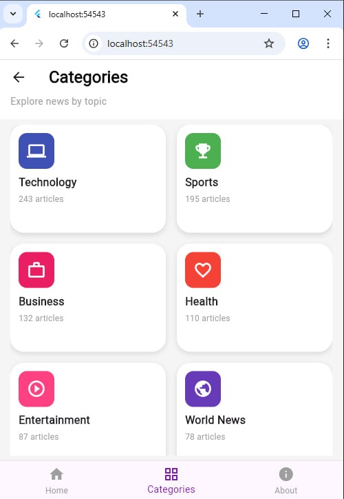
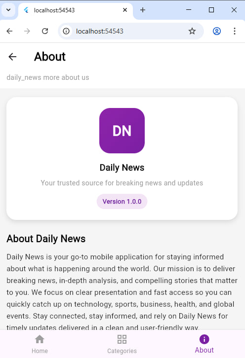

# 📰 Daily News App (Flutter)

Daily News is a modern Flutter mobile application that helps users stay informed with the latest news across multiple categories such as Technology, Sports, Business, Health, and more. The app focuses on clean UI, smooth navigation, and fast access to important news updates.

---

##  Features

- 🏠 **Home Screen**
  - Displays featured news articles
  - Category chips for quick browsing
  - Clean and minimal UI

- 🗂 **Categories Screen**
  - Browse news by category
  - Grid layout with icons and article counts

- ℹ️ **About Screen**
  - App description and mission
  - App version information

- 📰 **News Detail Screen**
  - Full article view with image and content
  - Share and bookmark UI actions

- 📁 **Local JSON Data**
  - News loaded from local assets (`news.json`)
  - Offline-friendly

---

## 📸 Screenshots

Below are screenshots of the main app screens:

| Home Screen | Categories Screen |
|-------------|------------------|
|  |  |

| News Details | About Screen |
|--------------|--------------|
|  |  |

---

