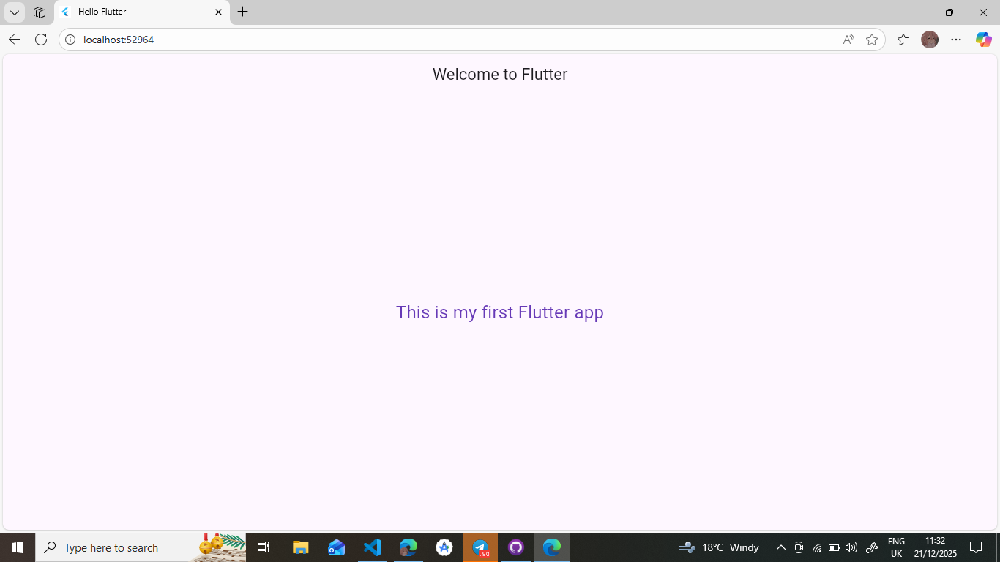

# hello_flutter

This is my first Flutter app.

## Widget Tree (File Hierarchy Format)

lib/
├── main.dart

### Widget Tree of the App

MyApp (StatelessWidget)
└── MaterialApp
├── title: "Hello Flutter"
├── theme: ThemeData(primarySwatch: Colors.pink)
└── HomePage (StatelessWidget)
└── Scaffold
├── AppBar
│ └── Text("Welcome to Flutter")
└── Body
└── Center
└── Text("This is my first Flutter app")

### Screenshot

