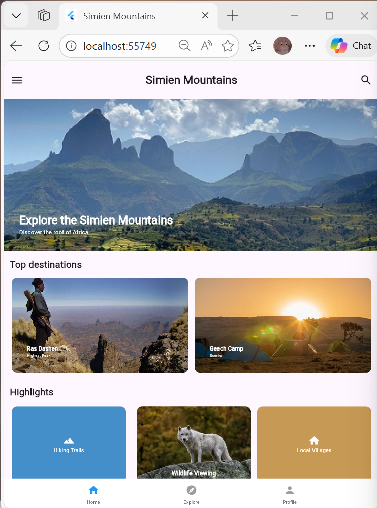
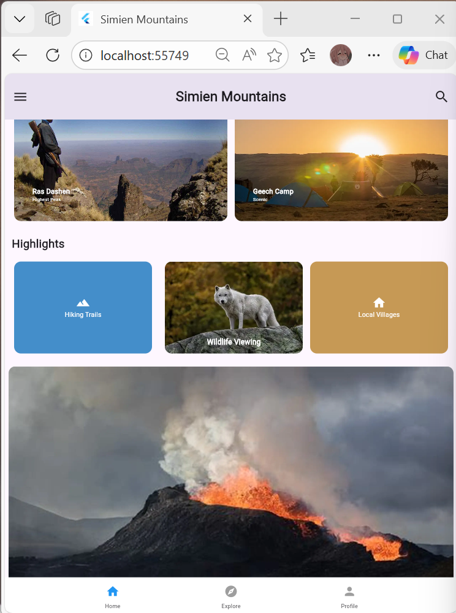
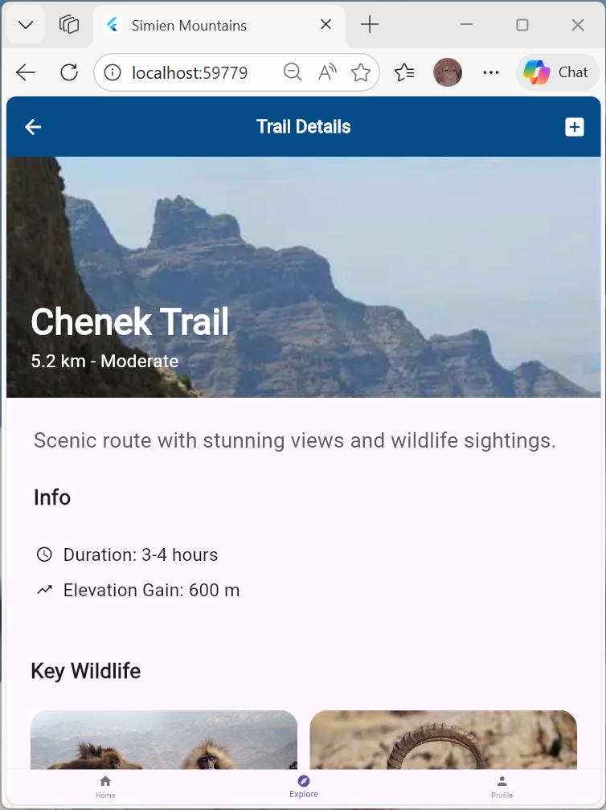
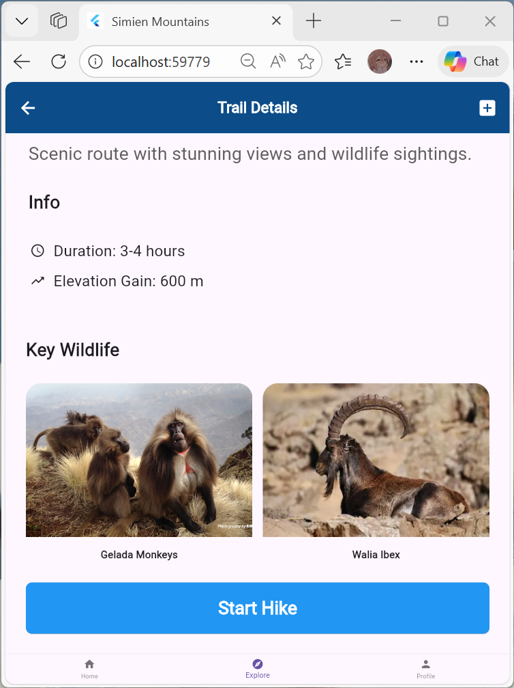

# 🏔️ Simien Mountains Travel App

A simple Flutter UI app showcasing the **Simien Mountains** with destinations and highlights. Built with `ImageCard` and `IconCard`.

---

## 📱 Screens

### 1️⃣ Home Screen

Hero image, top destinations, highlights, and bottom navigation.

**Screenshots (used in README):**



---

### 2️⃣ Trails

Chenek Trail

**Screenshots:**



---

### 3️⃣ Profile

Personal Profile 

**Screenshots:**


---

## 🚀 Run

```bash
flutter pub get
flutter run
```

---

**Note:** If images don’t show on GitHub, make sure `README.md` and the `ScreenShots/` folder (with those files) are committed and pushed to the `wild_life` repo.
