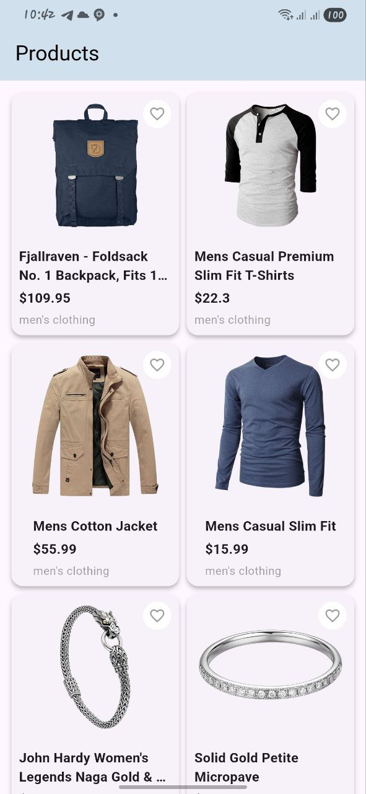
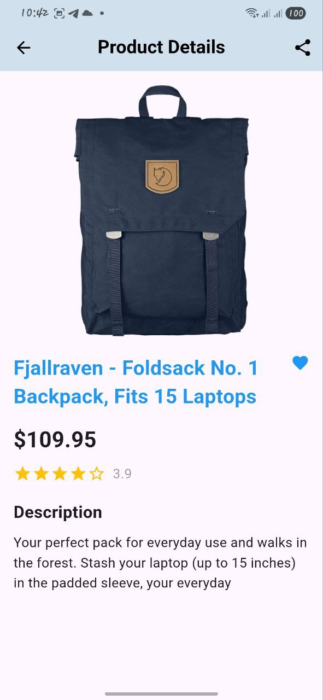

# Flutter E-Commerce App

A simple e-commerce mobile app built with Flutter that fetches products from an API and displays them in a grid. Users can view product details on a separate screen.

---

## 📱 Screens

### Screen 1 — Product List
- Fetches products from API: [https://fakestoreapi.com/products](https://fakestoreapi.com/products)  
- Displays products in a **two-column grid**  
- Shows **loading** and **error** states  
- Supports **pull-to-refresh** using `RefreshIndicator`

**Screenshot:**  


---

### Screen 2 — Product Detail
- Displays detailed information about a product:  
  - Product image  
  - Product title  
  - Description  
  - Price  
- UI highlights:  
  - Hero image  
  - Discount badge  
  - Star rating  
  - Back and share navigation icons

**Screenshot:**  


---

## ⚙️ Features

- Uses **Dio** for networking  
- Parses JSON into **type-safe models**  
- Fully **null-safe** code  
- Proper project structure for scalability  

---

## 🛠️ Installation

1. Clone the repository:  
   ```bash
   git clone https://github.com/HavenGoitom/flutter.git
````

2. Navigate to the project directory:

   ```bash
   cd week7/product_catalog
   ```

3. Get dependencies:

   ```bash
   flutter pub get
   ```

4. Run the app:

   ```bash
   flutter run
   ```

---

## 📦 Project Structure

```text
lib/
├── models/          # Product models
├── services/        # API services using Dio
├── views/           # Product list and detail screens
├── widgets/         # Reusable widgets
└── main.dart        # Entry point
```

---

## 💡 Notes

* The app demonstrates **Flutter state management**, **networking**, and **responsive UI**.
* Use `RefreshIndicator` on the product list for pull-to-refresh functionality.

```
